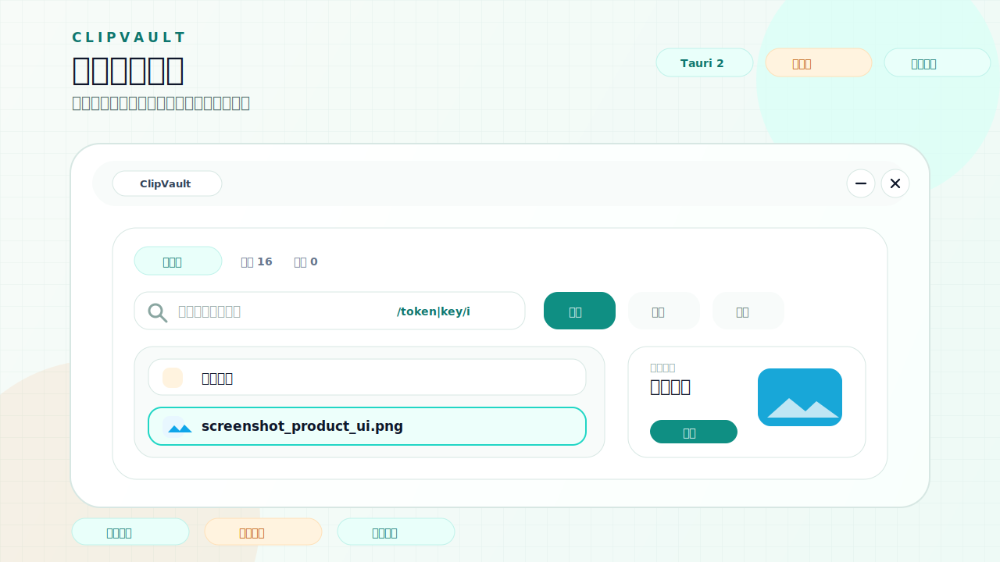
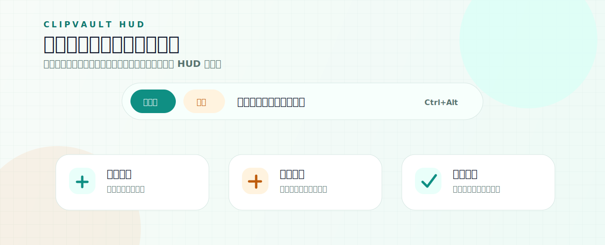
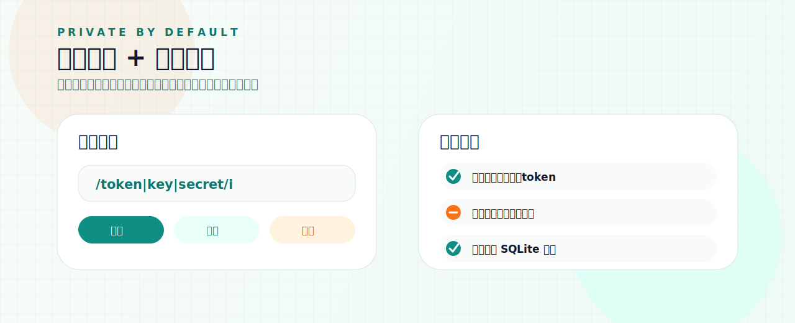

# ClipVault

<p align="center">
  
</p>

<h3 align="center">面向 Windows 的本地优先剪贴板管理器</h3>

<p align="center">
  搜索、预览、收藏、快速复制，让复制过的内容不再丢失。
</p>

<p align="center">
  <a href="#zh">中文</a>
  ·
  <a href="#en">English</a>
</p>

<p align="center">
  <a href="https://github.com/XxSbyH/ClipVault/actions/workflows/release.yml">
    
  </a>
  <a href="https://github.com/XxSbyH/ClipVault/releases/latest">
    
  </a>
  
  
  <a href="LICENSE">
    
  </a>
</p>



<p align="center">
  主面板 · 详情预览 · 正则搜索 · 本地优先
</p>




---

<a id="zh"></a>

## 中文

ClipVault 是一个面向 Windows 的本地优先剪贴板管理器。它已从 Electron 完整迁移到 Tauri 2，用更小的体积和更低的常驻资源占用，把系统单槽剪贴板扩展成可搜索、可分类、可预览、可快速复用的历史库。

适合开发、写作、资料整理、客服、运营和所有高频复制粘贴场景。

### 核心亮点

| 能力 | 说明 |
| --- | --- |
| 🧠 历史记录 | 保存文本、图片、文件路径、URL、代码、颜色和邮箱等常见内容 |
| 🔎 快速搜索 | 支持普通文本搜索，搜索框也支持 `/pattern/i` 和 `re:pattern` 正则匹配 |
| 🖼️ 图片预览 | 图片记录可在详情区预览，并展示大小、时间和使用次数 |
| ⚡ 快速复制 | 使用快捷键复制上一项/下一项到系统剪贴板，无需打开完整面板 |
| 🪄 HUD 反馈 | 用轻量浮层提示复制成功、面板唤起、快捷切换和状态变化 |
| 🔒 隐私过滤 | 默认跳过密码、银行卡号、身份证号、token/API key 等敏感内容 |
| 🚫 应用黑名单 | 指定应用中的剪贴板内容不会被记录，切换应用后也不会补录同一次复制 |
| 🖥️ 桌面集成 | 支持系统托盘、全局快捷键、自启动、单实例和暂停监听 |
| 🌗 主题模式 | 支持亮色、暗色、跟随系统 |
| 📦 小体积发布 | 基于 Tauri 2 + WebView2，不再携带 Electron runtime |

### 下载安装

从 Releases 下载最新 Windows 安装包：

```text
https://github.com/XxSbyH/ClipVault/releases/latest
```

发布文件说明：

| 文件 | 系统 | 用途 |
| --- | --- | --- |
| `ClipVault_*_windows_x64_setup.exe` | Windows 10/11 x64 | 安装包，推荐大多数 Windows 用户使用 |
| `ClipVault_*_windows_x64_portable.exe` | Windows 10/11 x64 | 便携版，适合免安装、临时运行或随身携带 |
| `ClipVault_*_macos_universal.dmg` | macOS Intel / Apple Silicon | macOS 安装镜像，按系统方式安装 |
| `ClipVault_*_macos_universal.app.zip` | macOS Intel / Apple Silicon | macOS 便携压缩包，解压后手动运行 |

当前版本未配置代码签名，Windows 首次安装时可能出现安全提示。
升级时先退出正在运行的 ClipVault，然后直接运行新版本 `ClipVault_*_windows_x64_setup.exe` 覆盖安装。历史记录、设置和黑名单保存在本地应用数据目录，不会因为覆盖安装被删除。

### 默认快捷键

| 快捷键 | 行为 |
| --- | --- |
| `Ctrl+Shift+V` | 打开或隐藏主面板 |
| `Ctrl+Shift+F` | 打开主面板并聚焦搜索 |
| `Ctrl+Shift+P` | 暂停或恢复监听 |
| `Ctrl+Shift+C` | 清空非收藏历史 |
| `Ctrl+Alt+Left` | 复制更旧的历史内容到剪贴板 |
| `Ctrl+Alt+Right` | 复制更新的历史内容到剪贴板 |
| `ArrowUp / ArrowDown` | 在面板内移动选择 |
| `Enter` | 复制当前选中项 |
| `Delete` | 删除当前选中项 |
| `Ctrl+D` | 收藏或取消收藏 |
| `Esc` | 隐藏面板 |

### 本地开发

环境要求：

| 工具 | 要求 |
| --- | --- |
| OS | Windows 10/11 x64 |
| WebView | Microsoft Edge WebView2 Runtime |
| Node.js | 20+ |
| pnpm | 9+ |
| Rust | stable MSVC toolchain |

推荐使用仓库根目录脚本：

```powershell
.\start-dev.bat
```

环境检查：

```powershell
.\start-dev.bat check
```

构建安装包：

```powershell
.\start-dev.bat build
```

手动安装依赖：

```powershell
pnpm install --store-dir D:\rj\pnpm-store
```

### 验证命令

提交前建议执行：

```powershell
pnpm typecheck
pnpm test
cargo fmt --manifest-path src-tauri\Cargo.toml --check
cargo test --manifest-path src-tauri\Cargo.toml
cargo clippy --manifest-path src-tauri\Cargo.toml -- -D warnings
pnpm build
```

### 数据与隐私

ClipVault 默认本地优先，不提供云同步。

默认行为：

- 文本在配置限制内保存并可搜索。
- 图片按配置压缩后保存。
- 文件类型只保存路径和元数据，不复制文件内容。
- 收藏项在清理时保留。
- 非收藏旧项按保留天数和最大条数清理。
- 从黑名单应用复制的内容不会写入历史；即使随后切换到普通应用，同一次剪贴板变更也会继续被忽略。

默认跳过的敏感内容：

- 疑似信用卡号。
- 美国 SSN 类格式。
- 中国身份证号。
- 密码赋值。
- 长大写字母数字 token/API key 类内容。

### 技术栈

| 层级 | 技术 |
| --- | --- |
| 桌面框架 | Tauri 2 + Rust 2021 |
| 前端 | React 18 + TypeScript + Vite |
| 样式 | Tailwind CSS |
| 状态管理 | Zustand |
| 列表性能 | react-window |
| 数据库 | SQLite + rusqlite + FTS5 |
| 测试 | Vitest + Testing Library + Cargo test |

### 发布流程

`main` 分支保持可发布状态。推送 `v*` 标签会触发 GitHub Actions 构建并发布 Release。

```powershell
git tag -a vX.Y.Z -m "ClipVault vX.Y.Z"
git push origin vX.Y.Z
```

### 其他

感谢 [LINUX DO 社区](https://linux.do/) 对开源项目分享和交流的支持。

### License

MIT © xxsby

---

<a id="en"></a>

## English

ClipVault is a local-first clipboard manager for Windows. It has been fully rebuilt from Electron to Tauri 2, keeping the core clipboard workflow while reducing package size and runtime overhead.

It is designed for development, writing, research, support work, operations, and any workflow that involves frequent copy and paste.

### Highlights

| Capability | Description |
| --- | --- |
| 🧠 Clipboard history | Stores text, images, file paths, URLs, code snippets, colors, emails, and more |
| 🔎 Search | Supports plain text search plus regex queries such as `/pattern/i` and `re:pattern` |
| 🖼️ Image preview | Preview copied images with metadata in the detail panel |
| ⚡ Quick copy | Copy previous/next history items to the system clipboard with global shortcuts |
| 🪄 HUD feedback | Lightweight overlay for copy success, panel state, and quick actions |
| 🔒 Privacy filter | Skips passwords, card numbers, identity numbers, tokens, and API keys by default |
| 🚫 App blacklist | Avoids recording clipboard content from configured apps, including the same clipboard change after switching apps |
| 🖥️ Desktop integration | Tray menu, global shortcuts, autostart, single instance, and monitoring pause/resume |
| 🌗 Theme modes | Light, dark, and system theme modes |
| 📦 Lightweight packaging | Tauri 2 + WebView2, without Electron runtime |

### Installation

Download the latest Windows installer from Releases:

```text
https://github.com/XxSbyH/ClipVault/releases/latest
```

Release asset guide:

| File | System | Use |
| --- | --- | --- |
| `ClipVault_*_windows_x64_setup.exe` | Windows 10/11 x64 | Installer, recommended for most Windows users |
| `ClipVault_*_windows_x64_portable.exe` | Windows 10/11 x64 | Portable executable for no-install or temporary use |
| `ClipVault_*_macos_universal.dmg` | macOS Intel / Apple Silicon | macOS disk image installer |
| `ClipVault_*_macos_universal.app.zip` | macOS Intel / Apple Silicon | Portable macOS app archive |

The current build is unsigned, so Windows may show a security prompt during first-time installation.
To upgrade, quit the running ClipVault process and run the newer `ClipVault_*_windows_x64_setup.exe` over the existing installation. History, settings, and blacklist data stay in the local app data directory.

### Default Shortcuts

| Shortcut | Action |
| --- | --- |
| `Ctrl+Shift+V` | Show or hide the main panel |
| `Ctrl+Shift+F` | Show the main panel and focus search |
| `Ctrl+Shift+P` | Pause or resume monitoring |
| `Ctrl+Shift+C` | Clear non-favorite history |
| `Ctrl+Alt+Left` | Copy older history item to clipboard |
| `Ctrl+Alt+Right` | Copy newer history item to clipboard |
| `ArrowUp / ArrowDown` | Move selection inside the panel |
| `Enter` | Copy selected item |
| `Delete` | Delete selected item |
| `Ctrl+D` | Toggle favorite |
| `Esc` | Hide the panel |

### Local Development

Requirements:

| Tool | Requirement |
| --- | --- |
| OS | Windows 10/11 x64 |
| WebView | Microsoft Edge WebView2 Runtime |
| Node.js | 20+ |
| pnpm | 9+ |
| Rust | stable MSVC toolchain |

Recommended startup command:

```powershell
.\start-dev.bat
```

Check local environment:

```powershell
.\start-dev.bat check
```

Build installer:

```powershell
.\start-dev.bat build
```

### Verification

Recommended commands before merging:

```powershell
pnpm typecheck
pnpm test
cargo fmt --manifest-path src-tauri\Cargo.toml --check
cargo test --manifest-path src-tauri\Cargo.toml
cargo clippy --manifest-path src-tauri\Cargo.toml -- -D warnings
pnpm build
```

### Privacy

ClipVault is local-first by default and does not implement cloud sync.

Default behavior:

- Text is stored within the configured size limit and remains searchable.
- Images are stored after configurable compression.
- File records store only paths and metadata, not file contents.
- Favorite items are preserved when cleaning history.
- Non-favorite old items are cleaned by retention days and max item count.
- Content copied from blacklisted apps is skipped, and the same clipboard change remains ignored after switching to a normal app.

### License

MIT © xxsby
